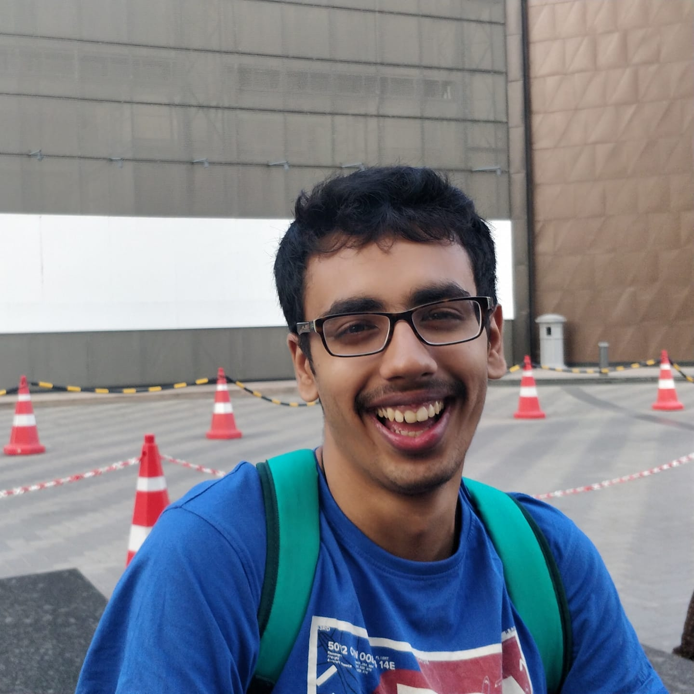

 

Hi there! I am Vimarsh, a final year CS undergrad at <a href="https://www.iitm.ac.in" target="_blank">IIT Madras</a>, India.  

I have a keen interest in GPU Programming, Program Analysis, Blockchain Networks and Math(mainly Statistics and Numerical Optimization). That being said, I'm not a fan of *debugging* projects in either of the aforementioned topics. 

In my free time, you'll see me working on side projects, messing around with my Ubuntu setup, wading through hackernews/reddit posts or watching anime. Sometimes, you might also catch me having long winded discussions about Java or CUDA semantics with my friends. I also like running, and play [squash](https://en.wikipedia.org/wiki/Squash_(sport)) and badminton (although this is on the backseat now due to COVID-19). 

Read more at 
* [CV](cv/cv.pdf)
* [Blog](/blog)

## Contact Me

* Email : [vimarsh.sathia@gmail.com](mailto:vimarsh.sathia@gmail.com) (main), [vimarsh@smail.iitm.ac.in](mailto:vimarsh@smail.iitm.ac.in), [cs17b046@cse.iitm.ac.in](mailto:cs17b046@cse.iitm.ac.in)
* Github : [vimarsh6739](https://github.com/vimarsh6739)
* LinkedIn : [Vimarsh Sathia](https://www.linkedin.com/in/vimarsh-sathia-83a85810a)
* Twitter : [@vimarsh_6739](https://twitter.com/vimarsh_6739)